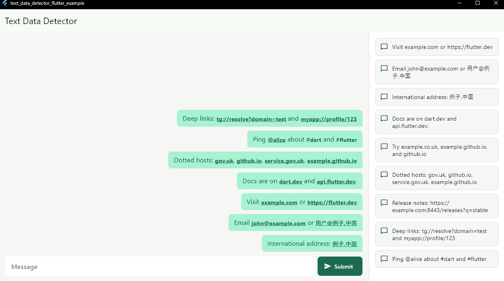

## text_data_detector

[](https://github.com/DaniiShi/text_data_detector/actions/workflows/dart.yml)

A pure Dart detector for extracting links, email addresses, phone numbers, calendar events, and custom patterns from plain text.

It is useful when you need to build chat messages, rich text, previews, clickable links, or any feature that needs stable text ranges without relying on platform-specific APIs.

Inspired by system data detector APIs such as iOS NSDataDetector, but implemented in pure Dart and available on every Dart platform.

## Features
Detects links, email addresses, and phone numbers.
Provides an opt-in calendar event detector for dates.
Returns stable start / end ranges for the original text.
Provides normalized values such as https://example.com or Punycode-normalized IDN domains.
Supports Unicode and IDN domains.
Supports custom detectors for mentions, hashtags, order numbers, dates, or app-specific patterns.
Works without Flutter plugins, native code, or platform channels.

## Usage

```dart
import 'package:text_data_detector/text_data_detector.dart';

void main() {
  final detector = DataDetector();

  final matches = detector.matches(
    'Visit example.com or email büro@münchen.de',
  );

  print(matches);
}
```

Result:

```dart
[
  DataDetectorMatch(
    type: DataMatchType.link,
    start: 6,
    end: 17,
    text: example.com,
    normalizedText: https://example.com,
  ),
  DataDetectorMatch(
    type: DataMatchType.emailAddress,
    start: 27,
    end: 42,
    text: büro@münchen.de,
    normalizedText: büro@xn--mnchen-3ya.de,
  ),
]
```
## Screenshot



## API Shape

```dart
final detector = DataDetector(
  options: DataDetectorOptions(
    linkOptions: const LinkDetectorOptions(allowCustomSchemes: true),
    emailOptions: const EmailDetectorOptions(allowUnicodeLocalPart: true),
    phoneOptions: const PhoneDetectorOptions(mode: PhoneDetectionMode.loose),
    matchWeights: {
      DataMatchType.emailAddress: 100,
      DataMatchType.link: 90,
      DataMatchType.phoneNumber: 80,
    },
  ),
);

final matches = detector.matches(text);

await for (final match in detector.matchesAsync(text)) {
  print(match);
}
```

There is also a string extension for one-off scans:

```dart
final matches = 'Open example.com'.dataDetectorMatches();

final calendarMatches = 'Meet February 29, 2024'.dataDetectorMatches(
  additionalRules: [
    CalendarEventDetector.extended(
      options: CalendarEventDetectorOptions(
        referenceDate: DateTime(2026, 6, 11),
      ),
    ),
  ],
);
```

`DataDetectorMatch` includes the original string range, original text,
normalized text, and an optional typed value:

```dart
match.type;
match.start;
match.end;
match.text;
match.normalizedText;
match.value;
match.uri;
match.emailAddress;
match.phoneNumber;
match.calendarEvent;
```

`start` and `end` are offsets into the original Dart string. `end` is exclusive,
matching `String.substring(start, end)`.

## Calendar Events

Calendar event detection is opt-in because date text has more false positive
risk than links or email addresses:

```dart
final detector = DataDetector(
  additionalRules: [
    CalendarEventDetector.extended(
      options: CalendarEventDetectorOptions(
        referenceDate: DateTime(2026, 6, 11),
        numericDateOrder: NumericDateOrder.dayMonthYear,
      ),
    ),
  ],
);

final matches = detector.matches('Meet February 29, 2024');
```

This returns one `DataMatchType.calendarEvent` match with:

```dart
match.text; // February 29, 2024
match.normalizedText; // 2024-02-29
match.calendarEvent?.start; // DateTime(2024, 2, 29)
```

The default detector supports dot- and slash-separated numeric dates using
configurable DMY, MDY, or YMD order, plus time-only values and time ranges.
`CalendarEventDetector.extended()` adds English full and abbreviated month
names, and relative dates such as `today`, `tomorrow`, `yesterday`,
`3 days ago`, and `2 weeks ago` when no `additionalPatterns` are supplied.
Relative dates are resolved using `referenceDate`.

For custom calendar syntax, replace or extend the pattern pipeline:

```dart
final customOnly = CalendarEventDetector.custom(
  patterns: [MyCalendarPattern()],
);

final extended = CalendarEventDetector.extended(
  additionalPatterns: [MyRussianRelativeDatePattern()],
);

final extendedWithBuiltInExtras = CalendarEventDetector.extended();
```

## Custom Detection

`DataMatchType` is a small value object, so applications can define their own
types and rules next to the built-in link, email, phone, and calendar event
rules.

`DataDetector` has two rule lists:

- `baseRules` replaces the built-in base rule pipeline. If omitted, link, email,
  and phone rules are used. Pass `baseRules: const []` to disable all
  built-ins.
- `additionalRules` appends application-specific rules after the base rule
  pipeline.

`DataDetectorOptions.matchWeights` controls which match wins when detectors
return overlapping ranges. Higher weight wins; if weights are equal, the longer
range wins. Built-in rules in `baseRules` get default weights unless
overridden: email 100, link 90, phone 80. Custom match types default to 0 unless
a weight is provided.

```dart
const mentionType = DataMatchType('mention');
const hashtagType = DataMatchType('hashtag');

final detector = DataDetector(
  additionalRules: const [MentionDetector(), HashtagDetector()],
  options: DataDetectorOptions(
    matchWeights: {
      mentionType: 70,
      hashtagType: 60,
    },
  ),
);
```

Example detector:

```dart
final class MentionDetector implements DataDetectorRule {
  const MentionDetector();

  static final RegExp _pattern = RegExp(
    r'(?<![\w@])@[A-Za-z][A-Za-z0-9_]{1,31}',
  );

  @override
  List<DataDetectorMatch> detect(String text) {
    return [
      for (final match in _pattern.allMatches(text))
        DataDetectorMatch(
          type: mentionType,
          start: match.start,
          end: match.end,
          text: match.group(0)!,
          normalizedText: match.group(0)!.toLowerCase(),
          value: match.group(0)!.substring(1).toLowerCase(),
        ),
    ];
  }
}
```

To run only custom detectors:

```dart
final detector = DataDetector(
  baseRules: const [],
  additionalRules: const [MentionDetector(), HashtagDetector()],
  options: DataDetectorOptions(
    matchWeights: {mentionType: 70, hashtagType: 60},
  ),
);
```

## Link Detection

The link detector uses a staged pipeline:

1. Find broad link candidates with a regex.
2. Treat explicit `scheme://...` candidates as strong link signals after
   validating the scheme with `^[a-zA-Z][a-zA-Z0-9+.-]*$`.
3. By default, accept standard schemes such as `http`, `https`, `ftp`, `ftps`,
   `ws`, and `wss`.
4. With `LinkDetectorOptions(allowCustomSchemes: true)`, also accept deep-link
   schemes such as `tg://...` and `myapp://...`.
5. For candidates without an explicit scheme, validate host syntax and require
   an ending from the generated Public Suffix buckets. Multi-label suffixes such
   as `gov.uk` and `github.io` are accepted as link-like text even when they
   appear by themselves.
6. Return `DataDetectorMatch` objects with original ranges and normalized link
   text.

Examples:

```text
example.com        -> https://example.com
example.co.uk      -> https://example.co.uk
gov.uk             -> https://gov.uk
github.io          -> https://github.io
ftp://example.com/file -> ftp://example.com/file
tg://resolve?domain=test -> accepted with allowCustomSchemes
myapp://profile/123 -> accepted with allowCustomSchemes
http://127.0.0.1 -> http://127.0.0.1
example.com:8080/path -> https://example.com:8080/path
com                -> rejected, single-label TLD
ф.ф                -> rejected, unknown public suffix
localhost          -> rejected
dev.local          -> rejected
bad_scheme://x     -> rejected, invalid scheme
```

```dart
final detector = DataDetector(
  options: const DataDetectorOptions(
    linkOptions: LinkDetectorOptions(allowCustomSchemes: true),
  ),
);
```

IDN hosts are normalized to ASCII/Punycode before Public Suffix List matching
and before building `normalizedText`, while `DataDetectorMatch.text`, `start`,
and `end` still point to the original user text:

```text
ds.vermögensberater       -> https://ds.xn--vermgensberater-ctb
ds.xn--vermgensberater-ctb -> https://ds.xn--vermgensberater-ctb
```

## Email Detection

The email detector reuses the same host pipeline as link detection. Only the
domain is converted to Punycode. Unicode local-parts are preserved for
EAI/SMTPUTF8-style addresses:

```text
john@example.com    -> john@example.com
anton@münchen.de    -> anton@xn--mnchen-3ya.de
büro@münchen.de     -> büro@xn--mnchen-3ya.de
用户@例子.中国        -> 用户@xn--fsqu00a.xn--fiqs8s
```

Set `EmailDetectorOptions(allowUnicodeLocalPart: false)` when you only want
ASCII text before the `@`.

## Phone Detection

Phone detection defaults to `PhoneDetectionMode.strict`. In strict mode, a phone
candidate needs an explicit signal: a leading `+`, parentheses around an
area/operator code, hyphenated groups, or phone-like whitespace grouping. Plain
digit runs without such a signal are rejected.

```text
+1 999 555-11-22  -> +19995551122
+19995551122      -> +19995551122
8 (999) 555-11-22 -> 89995551122
(800) 555-1234    -> 8005551234
999-555-1122      -> 9995551122
999 555 1122      -> 9995551122
```

For behavior closer to system detectors on iOS and Android, use loose mode. It
accepts any candidate with 7-15 digits, with fewer format checks, and allows
spaces, hyphens, dots, and parentheses:

```dart
final detector = DataDetector(
  options: const DataDetectorOptions(
    phoneOptions: PhoneDetectorOptions(mode: PhoneDetectionMode.loose),
  ),
);
```

```text
9994885764358     -> 9994885764358
9995551           -> 9995551
+1 999 555-11-22  -> +19995551122
123456            -> rejected, too short
1234567890123456  -> rejected, too long
```

The digit limits can be adjusted with `PhoneDetectorOptions.minDigits` and
`PhoneDetectorOptions.maxDigits`.

## Public Suffix List

The runtime does not read or parse a PSL text file during detection. The current
implementation uses generated Dart data bucketed by TLD, which keeps the lookup
path simple and allocation-light.
